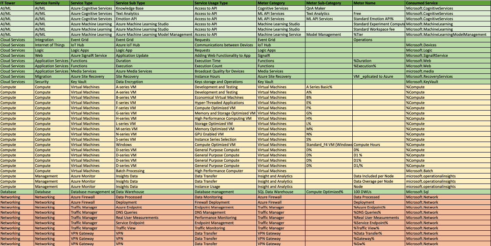

# Лабораторная работа 2. Сравнение сервисов Amazon Web Services и Microsoft Azure. Создание единой кросс-провайдерной сервисной модели.

Вариант 3

## Описание работы

### Цель работы:

Получение навыков аналитики и понимания спектра публичных облачных сервисов без привязки к вендору. Формирование у студентов комплексного видения Облака. 

### Дано:

1. Данные лабораторной работы 1.
2. Слепок данных биллинга от провайдера после небольшой обработки в виде SQL-параметров. Символ % в начале/конце означает, что перед/после него может стоять любой набор символов.
3. Образец итогового соответствия, что желательно получить в конце. 

### Необходимо:

1. Импортировать файл .csv в Excel или любую другую программу работы с таблицами. Для Excel делается на вкладке Данные – Из текстового / csv файла – выбрать файл, разделитель – точка с запятой.
2. Распределить потребление сервисов по иерархии, чтобы можно было провести анализ от большего к меньшему (напр. От всех вычислительных ресурсов Compute дойти до конкретного типа использования - Выделенной стойка в датацентре Dedicated host usage). При этом сохранять логическую концепцию, выработанную в Лабораторной работе 1.
3. Сохранить файл и залить в соответствующую папку на Google Drive.

### Алгоритм работы:

Сопоставить входящие данные от провайдера с его же документацией. Написать в соответствие колонкам справа значения 5 колонок слева, которые бы однозначно классифицировали тип сервиса. Для столбцов IT Tower и Service Family значения можно выбрать из образца. В ходе выполнения работы не отходить от принципов классификации, выбранных в Лабораторной работе 1. Например, если сервис Машинного обучения был разбит на Вычислительные мощности и Облачные сервисы, то продолжать его разбивать и в новых данных.

## Ход работы

### Описание сервисов

- **Azure Cognitive Services** - это набор облачных API, позволяющий разработчикам добавить в свои приложения функции анализа изображений, текста, речи, видео и других данных.

- **Azure Machine Learning** - платформа от Microsoft Azure, которая предоставляет инструменты и услуги для разработки, обучения, развертывания и управления моделями машинного обучения (ML). Она предназначена для профессиональных дата-сайентистов, разработчиков и организаций, стремящихся использовать машинное обучение для решения бизнес-задач.

- **Event Grid** — облачный сервис, для обработки и "разруливания" событий между разными приложениями и сервисами. Он служит промежуточным этапом для передачи событий.

- **IoT Hub** — это также промежуточный этап, для подключения, управления и взаимодействия с устройствами Интернета вещей

- **Logic Apps** — нужен для автоматизации рабочих процессов. Позволяет создавать процессы без кода, используя графический интерфейс.

- **Azure SignalR Service** — сервис, который упрощает создания сценариев в реальном времени (например отправка уведомлений, обновление данных и взаимодействие с пользователями).

- **Azure Functions** — cервис для бессерверных вычислений, позволяющий запускать код в ответ на триггеры.

- **Azure Virtual Machines** — просто (не очень) сервис, который умеет создавать виртуальные сервера в облаке.

- **Azure Monitor** — сервис для мониторинга, диагностики и анализа работы приложений и ресурсов в облаке и на локалках. Может собирать, анализировать и реагировать на данные о производительности.

- **Azure Synapse Analytics** — аналитическая платформа, которая объединяет возможности для обработки и анализа больших данных.

-  **Azure Media Services** — платформа для обработки, трансляции и отправки видео и аудио. Она умеет в кодировку, хранение, защиту и анализ.

- **Azure Site Recovery** — это своего рода ИБП'шка. Защищает данные и обеспечивает бесперебойную работу приложений при сбоях.

- **Azure Firewall** — это облачный сервис для управления и защиты сети. Он обеспечивает защиту для приложений и виртуальных машин, управляя трафиком и фильтруя его.

- **Azure Traffic Manager** — сервис маршрутизации трафика, для управления трафиком между различными  точками (сайтами, API или приложениями).

- **Azure VPN Gateway** — Ажуровский впн... 
безопасно соединит вас с другими сетями в Azure или с локальными ресурсами через виртуальные частные сети.

- **Azure Key Vault** — сервис для хранения и управления секретами и сертификатами.

Как результат работы - заполненная [таблица](https://docs.google.com/spreadsheets/d/1cUJttPWT17DLtPpcYGmr76P0kqnDRL1ub9pbu-arQng/edit?usp=sharing)

## Вывод

Изучили много полезных сервисов Azure.