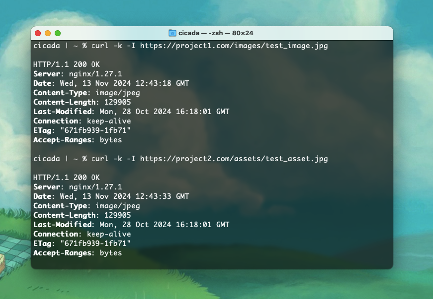

# Лабораторная №1

Сегодня разберем настройку nginx

## Ход выполнения

Я работаю с mac, поэтому все команды будут предоставлены используя оболочку zsh
Установливаем nginx:
`brew update`
`brew install nginx`

Запускаем и смотрим приветственное сообщение:

`brew services start nginx`
`curl http://127.0.0.1:8080`

Переходим к созданию своих "проектов". У меня это две почти одинаковых страницы. Вы можете расположить их где угодно:
project1/index.html sample:
`
<html>
    <body>
        <h1>Project 1 :)</h1>
    </body>
</html>
`

Перейдем к созданию сертификатов для наших "сайтов"
Используем гугл и получаем ответ по первой ссылке на stackoverflow, что-то типа:

`openssl req -x509 -days 365 -newkey rsa:4096 -keyout /usr/local/etc/nginx/ssl/project1.key -out /usr/local/etc/nginx/ssl/project1.crt`

Дублируем для второго "сайта" и радуемся

Теперь настраеваем конфиг ngimnx.conf (смотри файл в корне)
Глобальные настройки:
- worker_processes 1; - nginx использует один процесс для обработки
- В разделе #error_log и #pid указаны пути для логов ошибок
- worker_connections 1024; — количество соединений, которые может обрабатывать каждый процесс одновременно
html секция:
- listen 80; — сервер слушает порт 80 для HTTP запросов.
- server_name project1.com project2.com; — сервер обслуживает оба домена.
- В location / все HTTP запросы перенаправляются на HTTPS 
- listen 443 ssl; — сервер слушает порт 443 и использует SSL.
- ssl_certificate и ssl_certificate_key — пути к SSL-сертификату и ключу для project1.com.
- root /Users/cicada/project1/; — директория проекта.
- index index.html; — основной файл для отображения в корневом каталоге.
- В location / сервер пытается найти запрашиваемый файл или директорию. Если файл не найден, возвращается ошибка 404:
- alias для создания псевдонимов путей

Проверяем тз, видим что все подходит, занчит - перезапускаем nginx

`sudo nginx -s reload`

Пытаемся проверить доступ + сразу чекаем алиасы:
`curl -k -I https://project1.com/images/test_image.jpg`
`curl -k -I https://project2.com/assets/test_asset.jpg`
(Должны получить данные о наших подставных картиночках)

Также пробуем в браузере:

## Источники информации

